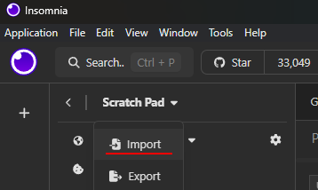

# Avaliacão 02

**Tema:**
    Missões para um jogo MMORPG 

**Descrição:**
    API para consultar e gerar *Quest*s (missões) para um jogo *MMORPG* baseado no sistema de RPG [Dungeons & Dragons](https://en.wikipedia.org/wiki/Dungeons_%26_Dragons) com informações hosteadas na API pública [`api.open5e.com`](https://open5e.com).
    
## Exemplo
Use o Scratch Pad do [Insmonia](https://insomnia.rest/) disponível [aqui](insomnia_example.json) para testar a API.



## Rotas

### <span style="color:steelblue;">`GET`</span> `/quests`

**Descrição:**
Lista todas as quests armazenadas na API de acordo com os filtros. Caso algum filtro não seja especificado, este é desconsiderado e todos os resultados para o parâmetro filtrado são retornados. Consulte [aqui](#resposta) para o tipo de resposta do request.
|parâmetro|descrição|tipo|
|---|---|---|
|challengeRating|Filtrar por nível de desafio|`int`|
|nMonsters|Filtrar por número de monstros|`int`|
|rewardRarity|Filtrar por raridade da recompensa|`"common"` \| `"uncommon"` \| `"rare"` \| `"Very Rare"` \| `"Legendary"` |


### <span style="color:orangered;">`POST`</span> `/newQuest`

**Descrição:**
Gera uma quest aleatória com base nos parâmetros desejados e a armazena na API para ser consultada na rota [`/quests`](#get-quests). Consulte [aqui](#resposta) para o tipo de resposta do request.

**Body:**
```jsonc
{
  // dificuldade do desafio
  "challengeRating": 0,

  // número de monstros
  "nMonsters": 0,

  // raridade da recompensa
  "rewardRarity": "common" | "uncommon" | "rare" | "Very Rare" | "Legendary" 
}
```

## Resposta
Todas as rotas retornam uma [Quest](src/main/java/br/net/kauan/produto/models/Quest.java) em formato JSON, conforme o corpo abaixo:

```jsonc
[
  {
    "mob": [ // lista monstros
      {
        "name": "string",
        "size": "string",
        "type": "string",
        "subtype": "string",
        "alignment": "string",	
        "cr": 0	// challenge rating (nível do desafio)
      },
      // [...]
    ],
    "loot": {
      "name": "string",
      "type": "string",
      "desc": "string",
      "rarity": "common" | "uncommon" | "rare" | "Very Rare" | "Legendary"
    },
    "challengeRating": 0 // soma do cr de todos os monstros do mob
  },
  // [...]  
]
```